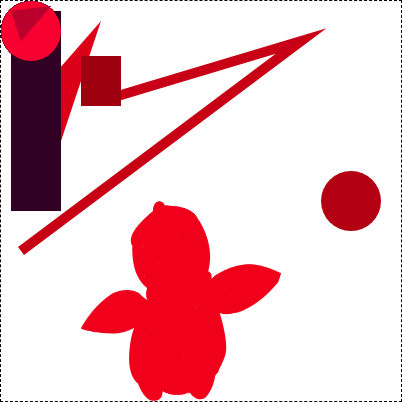

# react-interactive-canvas

> Declarative canvas components that support mouse events

[](https://www.npmjs.com/package/react-interactive-canvas) [](https://standardjs.com)

## [Demo](https://react-interactive-canvas-demo.herokuapp.com/)

To test local changes using the demo replace
```
"react-interactive-canvas": "x.x.x"
```
with
```
"react-interactive-canvas": "link.."
```
In the demo's `package.json`

## Install

```bash
npm install --save react-interactive-canvas
```

## Usage

```jsx
import React, { Component } from 'react'

import { Canvas, TransparentImage, Rectangle, Circle } from 'react-interactive-canvas'

class Example extends Component {
  handleClick = id => {
    console.log(id);
  }

  render () {
    return (
      <Canvas width={1000} height={1000}>
        <TransparentImage
          src="/images/penguin.png"
          id="penguin" // Required. Must be unique for every child of a <Canvas/>
          x={100}
          y={100}
          width={200}
          height={200}
          onClick={this.handleClick}/>
        <Rectangle
          onClick={this.handleClick}
          x={10}
          y={40}
          width={35}
          height={60}
          fillStyle="#2b2b2b"
          id="grey-rectangle" // Required. Must be unique for every child of a <Canvas/>
        />
        <Circle
          onClick={this.handleClick}
          x={200}
          y={200}
          radius={5}
          fillStyle="blue"
          id="blue-circle" // Required. Must be unique for every child of a <Canvas/>
        />
      </Canvas>
    )
  }
}
```

## How does it work?

##### There are four basic steps

  1. First draw each component on it's own little temporary "patch" canvas
  2. Draw all the patches onto the main visible canvas.
  3. Assign each component it's own unique color and swap out all non-transparent pixels on the patch canvases with those unique colors, masking the original pixels.
  4. Draw all the patches onto a hidden event canvas.

Once those steps are complete then for any mouse event on the main visible canvas you can just check the color of the corresponding pixel on the hidden event canvas to know which component was interacted with!

##### If the main canvas looks something like this:


##### Then after masking each component the event canvas might look something like this:


(it won't be visible to the user of course!)

## Motivation

Honestly this package was built kinda just for fun. In 99% of use cases you're gonna be better off just using an SVG. The only situations in which this might be useful are
1) You want pixel perfect* mouse event registration on the non-transparent pixels of an image.
2) You want to draw A LOT of shapes. (Having a lot of SVG elements can cause performance issues)

*yeah so this isn't exactly pixel perfect but it's pretty close. Canvas anti-aliasing makes this... difficult. But not impossible! Drawing pixel perfect shapes is dooable but it's a lot slower and requires you to manually implement shape definitions. See the `SAFE CIRCLE` comment in `Circle.js` as an example.

## Attribution
This project was bootstrapped using https://github.com/DimiMikadze/create-react-library

## License

MIT © [jbccollins](https://github.com/jbccollins)
